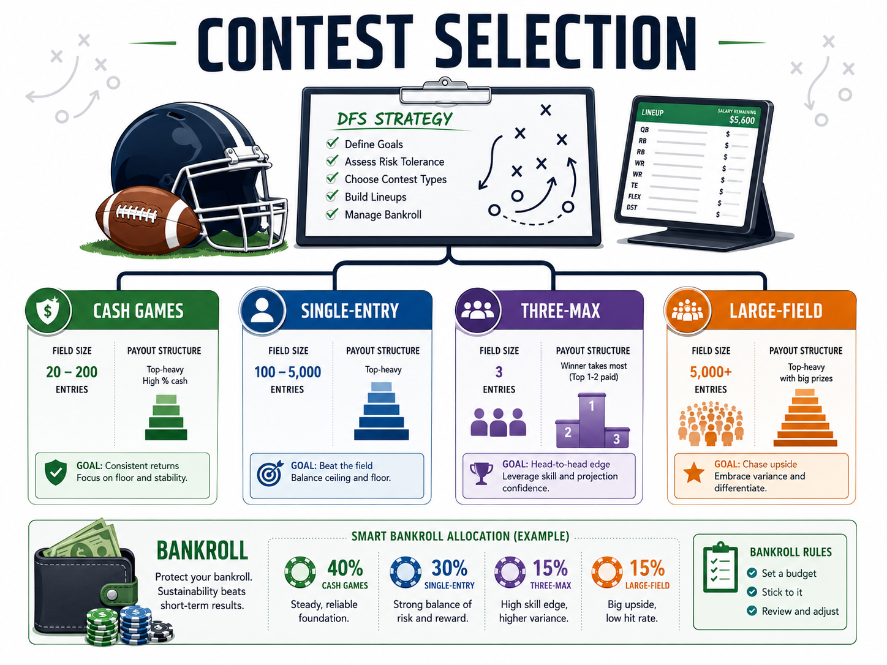

# Contest Selection

Contest selection determines what a lineup must accomplish. The same roster can be sensible in a double-up and poorly suited to a large-field tournament because the opponents, payout structures, and winning thresholds differ. Choose the contest before building so every roster decision serves a defined objective.

## Matching Strategy to Contest Type

Cash games, including double-ups and head-to-heads, reward finishing above a cutoff rather than beating the entire field. Stable volume and strong median projection carry greater value. Popular value plays can be useful because fading them adds risk without improving the payout for a top score.

Single-entry tournaments prevent opponents from submitting many lineup combinations. The field is often smaller and more deliberate, so a lineup can pair a strong projection with limited leverage. Three-max contests allow a small portfolio. Each entry should have its own coherent construction instead of changing one player around the same core.

Large-field tournaments have top-heavy payouts and thousands of opponents. A competitive lineup needs ceiling, [[stacking-and-correlation]], and a reasonable answer to duplication. Raw projection remains relevant, but the difference between 100th and 10,000th can pay little while the difference between tenth and first can be substantial.

### Bankroll Discipline

Set entry limits before lineup building. A practical process includes:

1. Define a weekly or slate-level amount at risk.
2. Allocate that amount by contest type.
3. Avoid increasing entries to recover a previous loss.
4. Track fees, winnings, and contest sizes over time.
5. Review results by format rather than by one volatile slate.

Payout structure should determine how much variance is acceptable. Flat structures support safer builds; top-heavy structures require greater ceiling and differentiation. That choice affects [[ownership-and-leverage]] before lock and the [[late-swap-process]] after early results become known.
